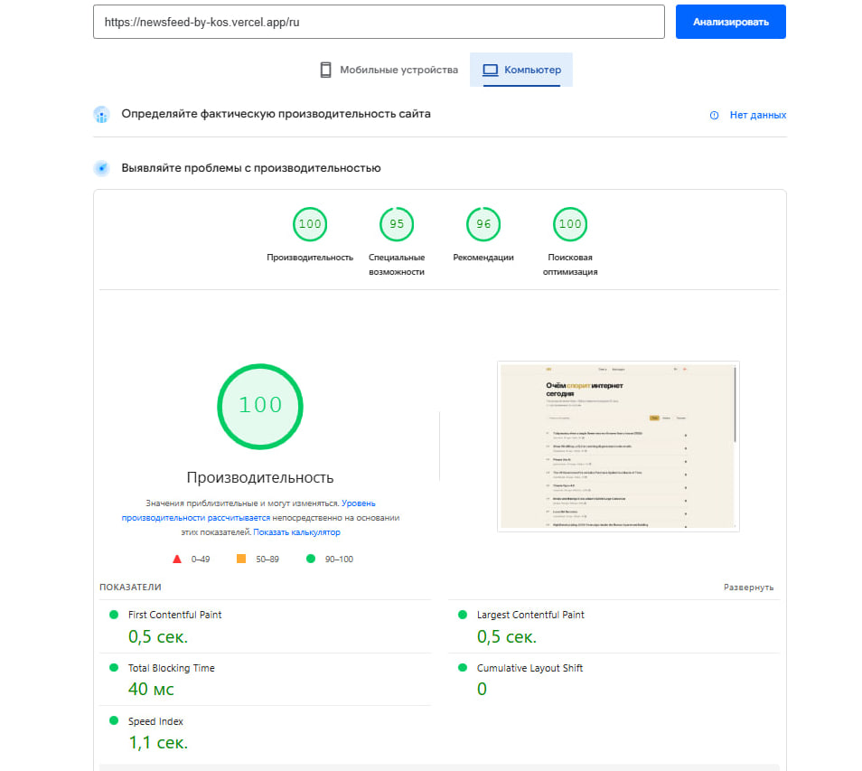
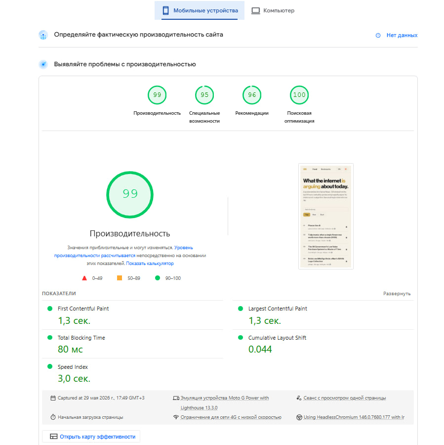

# О проекте

Показывает топовые истории с Hacker News с поиском через Algolia, фильтрами (top / new / best) и закладками. Статьи можно читать прямо в приложении - для этого написан серверный парсер на основе `@mozilla/readability` и `linkedom`, который получает исходную страницу и вытаскивает из неё чистый текст без рекламы и лишней разметки.

Для длинных списков реализован composable `useInfiniteScroll` на базе IntersectionObserver - контент подгружается порциями по мере скролла, не нагружая страницу сразу. Комментарии раскрываются рекурсивно по клику - каждый уровень вложенности загружается отдельным запросом только по требованию.

Состояние приложения разбито на Pinia сторы: истории, фильтры, закладки. Закладки сохраняются в `localStorage` и переживают перезагрузку страницы. Повторяющаяся логика вынесена в composables - пагинация по ID (`usePaginatedIds`), бесконечный скролл через IntersectionObserver (`useInfiniteScroll`), дебаунс для поиска (`useDebouncedRef`).

Поддерживает мультиязычность и возможность смены темы.

## Стек

| Технология                          | Зачем                                                       |
| ----------------------------------- | ----------------------------------------------------------- |
| **Nuxt 4**                          | SSR, роутинг, API routes                                    |
| **Vue 3.5**                         | Composition API, `<script setup>`, `shallowRef`, `computed` |
| **TypeScript**                      | Строгая типизация по всему проекту                          |
| **Pinia**                           | Стейт менеджмент - сторы для историй, фильтров и закладок   |
| **FSD**                             | Архитектурная методология                                   |
| **@nuxtjs/i18n**                    | Локализация, ленивая загрузка переводов                     |
| **@vueuse/core**                    | `useWindowScroll`, `useIntersectionObserver`                |
| **ky**                              | HTTP клиент                                                 |
| **@mozilla/readability + linkedom** | Серверный парсинг статей                                    |
| **SCSS**                            | Стили                                                       |
| **PrimeVue**                        | `Skeleton` и `Message` компоненты                           |

## Архитектура

Проект построен по FSD

```
pages/          - роуты
src/widgets/    - StoriesList, StoryComments, FeedHeader, StoriesToolbar
src/features/   - фильтры, поиск (Algolia), закладки
src/entities/   - story, comment - API, модели, UI компоненты
src/shared/     - HTTP клиент, composables, типы, базовые UI компоненты
```

## Запуск

```bash
npm install
npm run dev
```

Продакшн сборка:

```bash
npm run build
npm run preview
```

## Тестирование

### Юнит-тесты - Vitest

Покрывают изолированную логику без запуска браузера - быстро и без внешних зависимостей. Окружение `happy-dom`, каждый тест получает чистый стор через фабричную функцию `createStore()`.

```bash
npm run test
npm run test:watch  # watch-режим при dev режиме
```

Что покрыто:

- `useBookmarksStore` - добавление, удаление, защита от дублей, сохранение в `localStorage`
- `timeAgo` - форматирование unix timestamp в "5m ago", "3h ago", "2d ago"

### E2E тесты - Playwright

Запускают реальный браузер (Chromium + Mobile Chrome) и проверяют пользовательские сценарии от начала до конца. Перед запуском нужно скачать браузеры:

```bash
npx playwright install
```

Запуск тестов:

```bash
npm run test:e2e        # headless прогон
npm run test:e2e:ui     # интерактивный режим
```

Playwright автоматически поднимает `nuxt dev` если сервер не запущен, или переиспользует уже запущенный на порту 3000.

Что покрыто:

- Пустое состояние страницы закладок
- Отображение закладок из `localStorage` после перезагрузки
- Удаление закладки и возврат к пустому состоянию
- Кнопка закладки на карточке записывает данные в `localStorage`

### Pre-commit

Настроен через `husky` + `lint-staged`. Перед каждым коммитом последовательно запускаются:

1. **Prettier** - форматирование `*.ts`, `*.vue`, `*.scss`, `*.json`, `*.md`
2. **ESLint** - линтинг с правилом `no-explicit-any`, автофикс где возможно
3. **Vitest** - юнит-тесты, коммит не пройдёт если тесты упали

## Оптимизация

- **Tree-shaking PrimeVue** - убран из `manualChunks`, Rollup берёт только используемые компоненты. Unused JS: 166 kB -> 29 kB
- **PurgeCSS** - удаляет неиспользуемые CSS классы при сборке
- **Font preload** - Bold, Roman и Medium начертания загружаются с приоритетом через `<link rel="preload">`
- **Cache headers** - шрифты кэшируются на год (`immutable`), иконки на сутки
- **Asset compression** - gzip и brotli для статики через Nitro
- **Code splitting** - автоматический роут-левел сплиттинг + `manualChunks` для vue/pinia
- **`vite.optimizeDeps`** - pre-bundling зависимостей для быстрого старта dev сервера

### Результаты Lighthouse (production)

**Desktop**



**Mobile**


